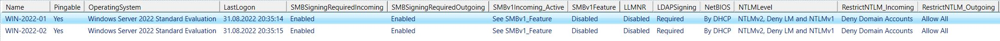

Powershell Script queries AD Computer's protocol settings (SMB/LDAP Signing, LLMNR, NetBIOS, NTLM).

This script began with 5 lines to query the SMB1 state of Windows Computers in an Actice Directory Environment. 
Over some months I added more queries, to get the state of SMB Signing, LDAP Signing, Link-local Multicast Name Resolution, NetBIOS and NTLM. 
It can be helpful for an overview o the hardening state. The results can be seen in a Grid and are exported to a csv-file.

I know the code is not very graceful in the release, but it is working and it is not finished yet.

